# 英语学习网站 MVP 产品需求文档（PRD）

## 文档信息

| 项目 | 内容 |
|------|------|
| 文档名称 | 英语学习网站 MVP 产品需求文档（PRD） |
| 产品名称 | 英语学习网站（暂定名） |
| 版本 | v0.1（MVP 定稿） |
| 文档状态 | 已评审，待进入技术方案阶段 |
| 作者 | 产品组 |
| 创建日期 | 2026-09-20 |
| 适用范围 | Web 端（桌面 + 手机浏览器，响应式） |
| 相关文档 | 低保真原型：目录 `docs/Prototype/html/`（走查总览从 `index.html` 进入）；Figma 搭建规格：`docs/Prototype/figma/figma_spec.md`；PRD×原型双向对照表：`docs/Prototype/PRD_prototype_mapping.md` |

## 修订记录

| 版本 | 日期 | 修改人 | 说明 |
|------|------|--------|------|
| v0.1 | 2026-09-20 | 产品组 | MVP 首版定稿：定位、功能范围、核心流程、FR、用户故事、指标齐备 |
| v0.2 | 2026-09-22 | 产品组 | 接入低保真原型：主线流程嵌入原型线框图、FR 补充原型页面引用、新增原型走查说明与页面索引 |

# 1. 项目背景与问题陈述

## 1.1 项目背景

四六级、考研是每年数百万学生必须跨越的关卡，而「词汇量」是其中最基础、最刚需、也最难坚持的一环。背单词工具市场虽已存在多家 App（百词斩、墨墨、不背单词等），但用户仍有大量不满与流失：

- 移动端 App 需下载安装，占内存、易略过；
- 复习算法不透明，用户不知道系统何时、为何安排复习；
- 缺席惩罚感强，中断几天后积压成山，直接放弃；
- 词表多按字母序排列，用户最先背的词并不常用，获得感差；
- 数据掌控感弱，无法导出自己的学习进度。

本项目希望以 **Web 端（浏览器即用，无需安装）** 切入，以「透明、不施压、纯背词」的极简产品赢取口碑。

## 1.2 现状痛点

| # | 痛点 | 用户感受 |
|---|------|---------|
| P1 | 需下载 App 才能使用 | 「装软件太麻烦，还要清理内存」 |
| P2 | 复习算法黑盒 | 「不知道为什么要复习这个词」 |
| P3 | 缺席即崩溃 | 「断了一周，回来两百多个词，算了不背了」 |
| P4 | 字母序词表 | 「背到 M 开头的词了，考试里根本用不上」 |
| P5 | 进度不可掌控 | 「换手机全没了」 |

## 1.3 机会与差异化

| 差异化维度 | 做法 |
|-----------|------|
| 载体 | Web 响应式站点，手机浏览器直接使用，零安装 |
| 算法透明 | 间隔规则公开：1 天 / 3 天 / 7 天递增，用户可感知 |
| 不施压 | 缺席回来后积压「分批容错」，无惩罚、可追平 |
| 词序好 | 按词频降序排列，高频先背，获得感前置 |
| 数据自主 | 登录后进度云同步；后续支持导出（CSV / Anki，P2） |

## 1.4 产品定位与愿景

> **产品定位**：一个面向四六级 / 考研学生的 Web 端背单词产品，把「记住单词」这件事做到极致。

**核心体验卖点**：疯狂的背词效率 + 干净无压力的体验。

**愿景**：成为备考学生每天花 10-15 分钟、像刷牙一样自然完成的学习习惯产品。

## 1.5 MVP 目标与成功标准

**北极星指标**：7 日留存率。

| 指标 | 定义 | 内测 2 周观察目标 |
|------|------|------------------|
| 首学漏斗完成率 | 进入产品后完成首次 5 词学习的访客占比 | ≥ 60% |
| 3 日留存 | 注册后第 3 天仍打开学习的用户占比 | 观察基线 |
| 7 日留存 | 注册后第 7 天仍打开学习的用户占比 | 决定 V2 方向的核心依据 |
| 日均完成率 | 当日新词与复习全部完成的天数占比 | 持续跟踪 |

## 1.6 非目标

MVP 明确不做：

- 口语练习（V2+，ASR 成本高）
- 阅读外刊（V2+，做「文章点词入生词本」）
- 排行榜 / 徽章 / 社交互动（避免「为激励而激励」）
- 真题模考、AI 助教、付费体系
- 数据导出（P2 差异化补充）

# 2. 目标用户与使用场景

## 2.1 用户画像

**画像一：大二备考四六级学生**

| 属性 | 说明 |
|------|------|
| 基本信息 | 19-21 岁，大学在读，备考 CET-4 / CET-6 |
| 目标 | 单词量达标（四级约 4500 / 六级约 5500），通过考试 |
| 场景 | 宿舍、通勤、图书馆碎片时间，多用手机浏览器 |
| 阻碍 | 自制力差，背单词枯燥，中途放弃概率高 |
| 核心诉求 | 高效的遗忘曲线提醒 + 看得见的进步 |

**画像二：考研二战 / 独立备考者**

| 属性 | 说明 |
|------|------|
| 基本信息 | 22-26 岁，准备全国硕士研究生入学考试 |
| 目标 | 吃透考研高频词汇（约 5500），拿下阅读与写作 |
| 场景 | 每天固定 1-2 小时自习，电脑与手机交替使用 |
| 阻碍 | 时间紧、任务重，需要「每一分钟都值」的效率感 |
| 核心诉求 | 高频词优先、复习节奏可控、数据透明 |

**画像三：碎片化学习体验者（泛用户）**

| 属性 | 说明 |
|------|------|
| 基本信息 | 18-30 岁，想提升英语但没有硬性考试目标 |
| 目标 | 保持语感、扩大词汇量 |
| 场景 | 偶尔点开，随时可能中断几天 |
| 阻碍 | 一旦积压就放弃 |
| 核心诉求 | 缺席后能轻松回归（分批容错），不责备 |

## 2.2 核心使用场景

**场景 A：每日清任务（留存核心）**

用户在一天中的某个固定时刻打开网站 → 看到「今日任务」（复习 + 新词）→ 依次完成 → 打卡成功（连续天数 +1）→ 整个流程 10-15 分钟内结束。

**场景 B：游客被吸引（转化核心）**

用户通过搜索或分享进入 → 免注册先学 5 个词 → 体验「记住了新词」的正反馈 → 被引导注册保存进度。

## 2.3 用户旅程地图（MVP 关键旅程）

| 阶段 | 认知 | 情绪关键点 | 关键设计 |
|------|------|-----------|---------|
| 接触 | 通过搜索/分享第一次看到产品 | 好奇、怀疑 | 公开词书详情页，SEO 友好 |
| 体验 | 游客试学 5 个词 | 成就感（第一次正反馈） | 试学流程极短、无注册门槛 |
| 转化 | 决定注册 | 怕麻烦、怕丢进度 | 注册 1 分钟内完成，进度延续 |
| 养成 | 每天回来清任务 | 稳定、可控 | 透明间隔、连续打卡可视化 |
| 回流 | 缺席几天后回归 | 怕积压 | 分批容错，任务量可控 |

# 3. 功能范围

## 3.1 版本范围（In / Out）

| 模块 | MVP（In） | V2+（Out） |
|------|----------|-----------|
| 用户系统 | 注册 / 登录、游客试学、进度云同步、学习设置 | 第三方登录 |
| 词书系统 | 内置 3 本词书、词频排序、小目标（前 N 词） | 自定义导入词表 |
| 学习流程 | 新词卡片自评、复习四选一自测、间隔调度 | 拼写 / 语音模式 |
| 打卡统计 | 连续天数、今日进度、掌握词数、词书完成度 | 图表报表导出 |
| 词书切换 | 多词书并行、进度独立 | 跨词书去重合并 |
| 内容 | 词条纠错反馈 | 人工扩充例句、图片联想记忆 |

## 3.2 MVP 功能清单

| 编号 | 功能 | 优先级 |
|------|------|--------|
| F1 | 注册 / 登录 / 游客试学 | P0 |
| F2 | 学习设置（每日新词数、目标词书、小目标） | P0 |
| F3 | 今日首页（任务面板） | P0 |
| F4 | 新词学习（卡片 + 三态自评） | P0 |
| F5 | 复习队列（四选一自测） | P0 |
| F6 | 间隔调度规则（记忆等级 + 间隔表） | P0 |
| F7 | 缺席分批容错 | P0 |
| F8 | 打卡与连续天数 | P0 |
| F9 | 进度统计 | P1 |
| F10 | 词书系统（词表 / 词序 / 词条字段） | P0 |
| F11 | 词书切换 | P1 |

# 4. 核心流程

## 4.1 首次使用漏斗（新用户发现到养成）

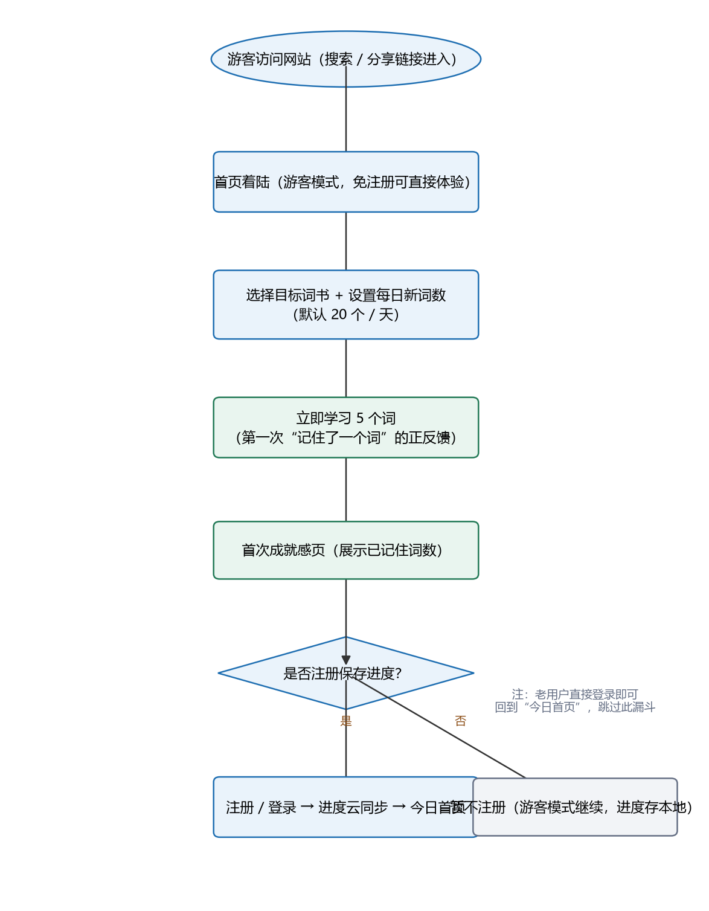

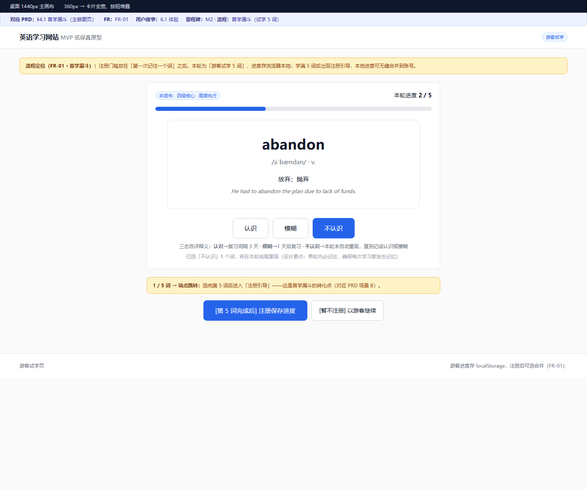

> 设计要点：任何注册门槛都必须放在用户「第一次记住一个词」之后。注册之前先给正反馈，是首学漏斗 ≥ 60% 的核心手段。

## 4.2 每日学习总流程

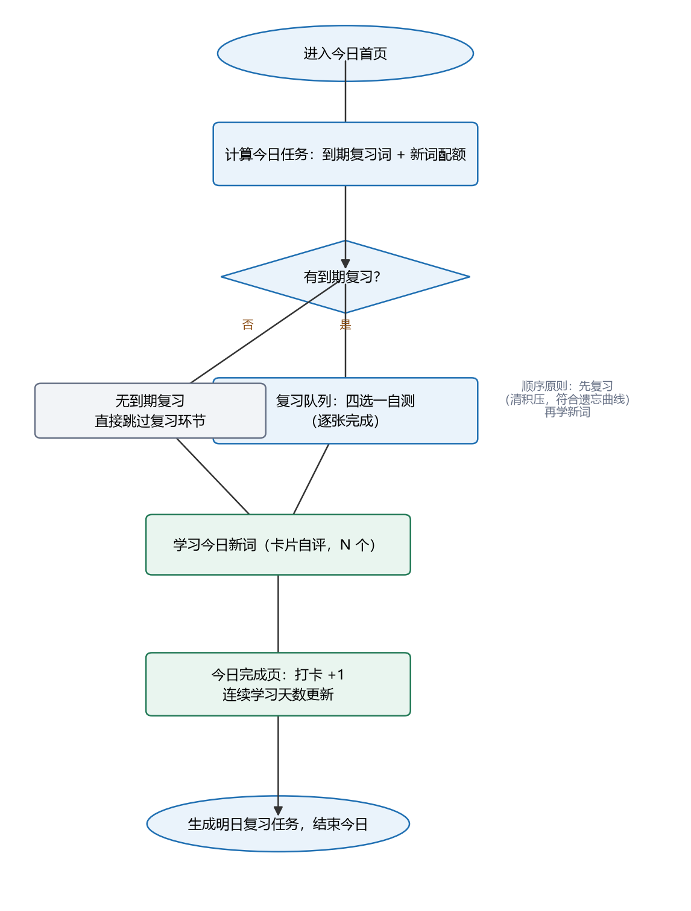

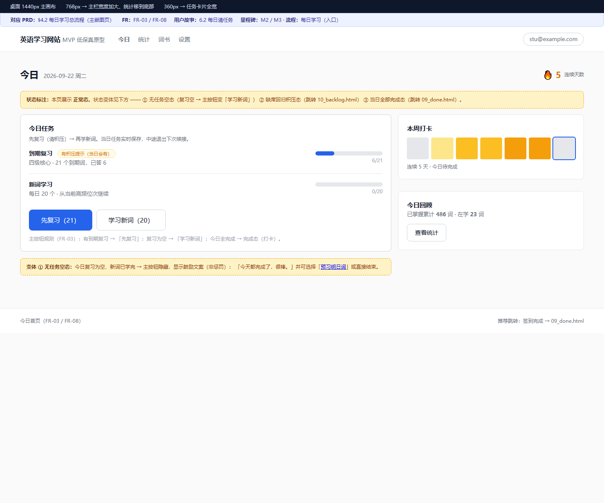

> 设计要点：先复习（清积压，符合遗忘曲线），再学新词。复习为空则直接进入新词，保证用户「今天有可做之事」。

## 4.3 新词学习与自评

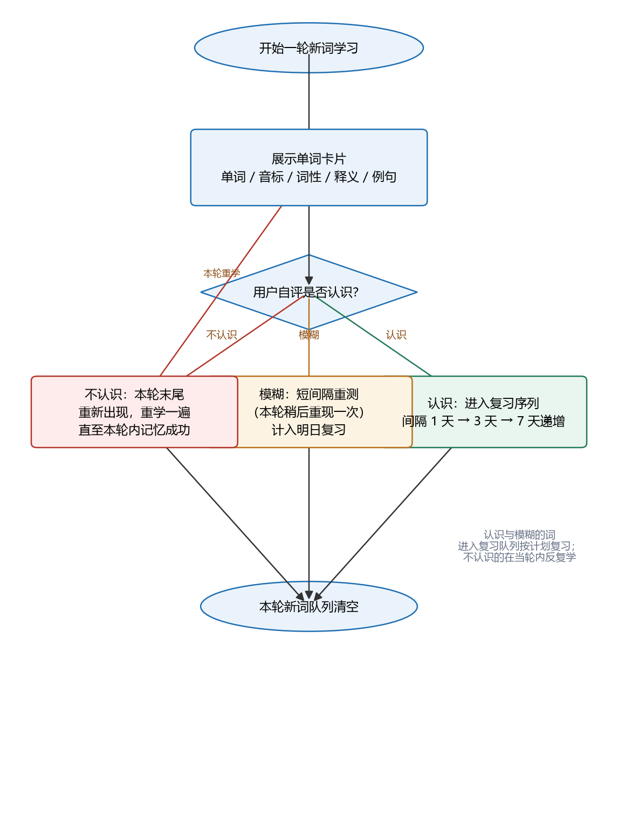

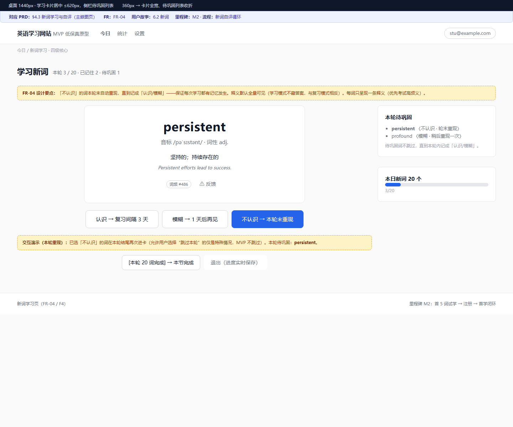

> 设计要点：以「本轮内必须记住」为原则——不认识的词在本轮末尾反复出现，直至记成「认识」或「模糊」，保证每一次学习都有记忆发生。

## 4.4 复习与间隔决策

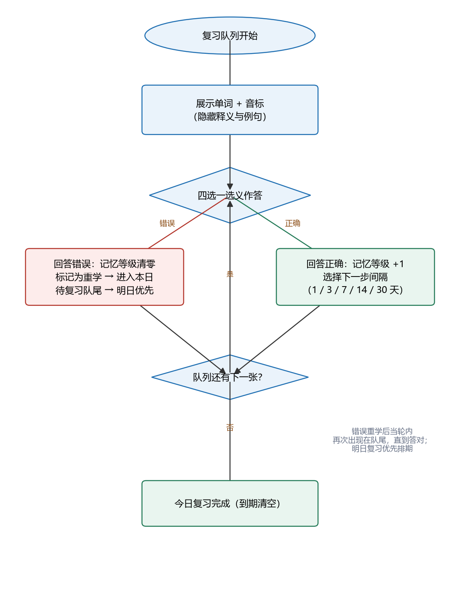

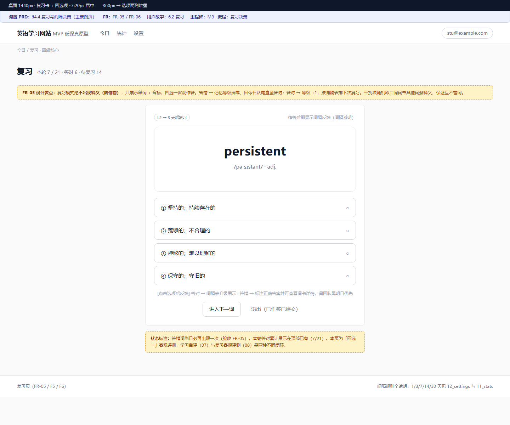

> 设计要点：复习用客观评测（四选一）而非自评，数据更真实；答错的词记忆等级清零并回到今日队尾，直到答对为止。

## 4.5 缺席分批容错

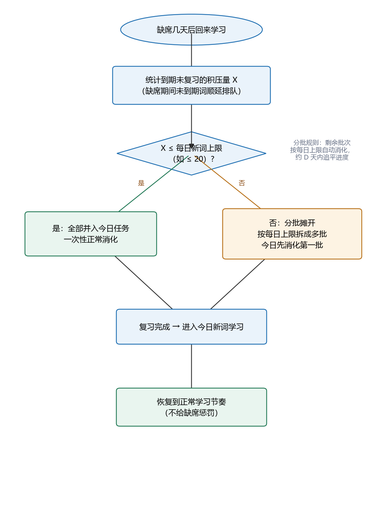

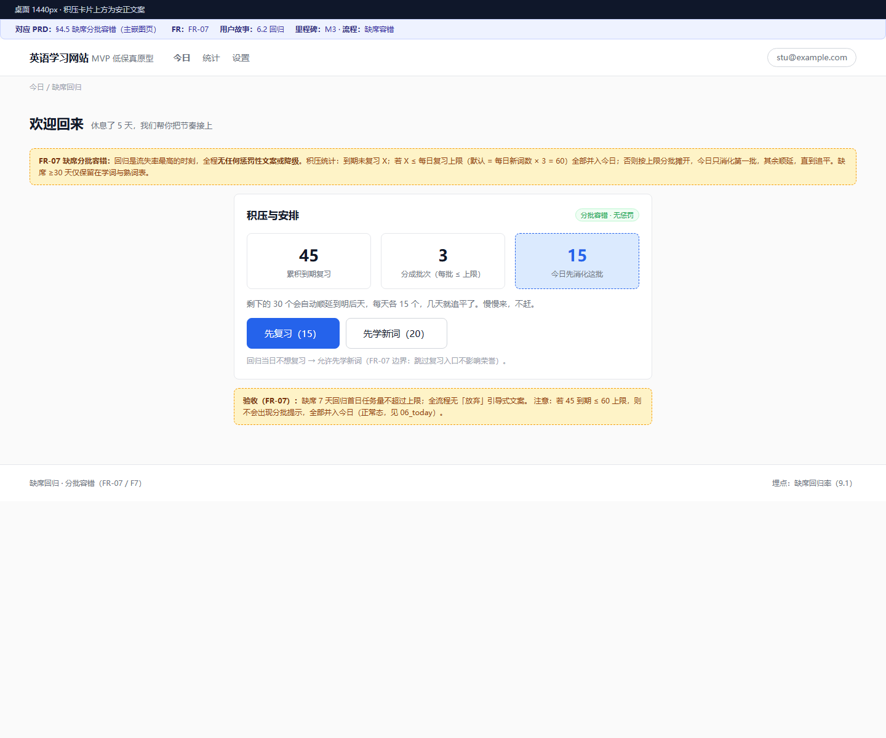

> 设计要点：缺席回归是用户流失率最高的时刻。积压超过每日上限时分批摊开，用「追得回来」的心理替代「放弃」。

## 4.6 词书切换

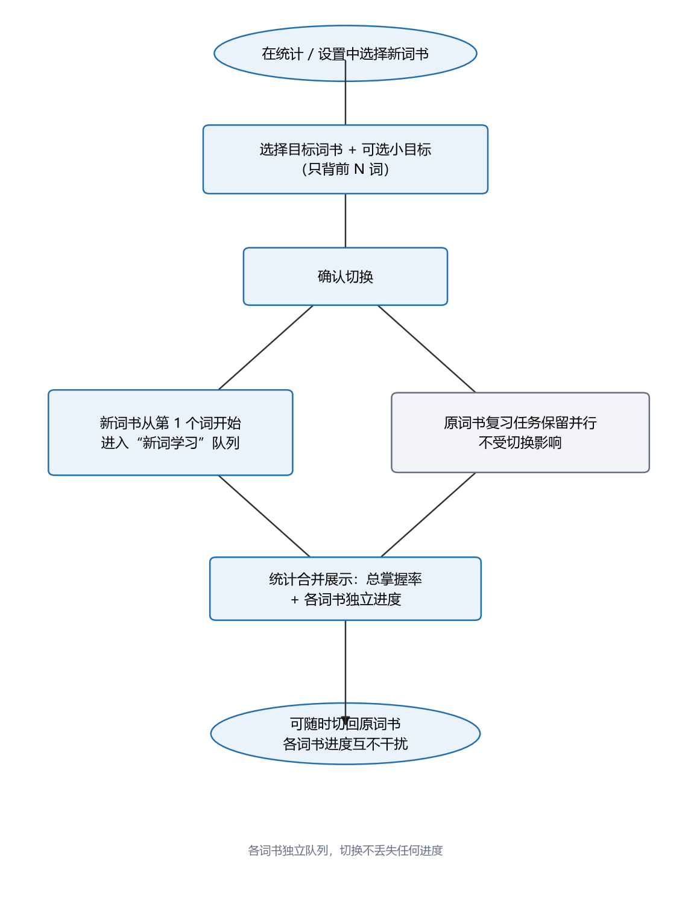

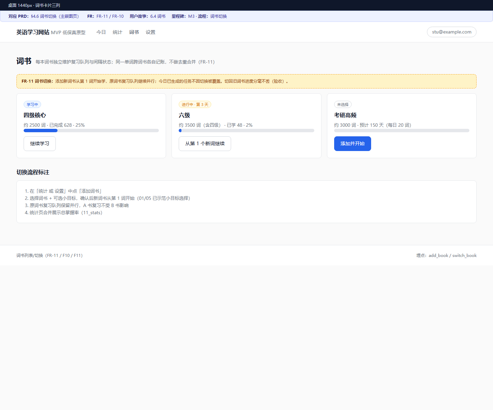

> 设计要点：新词复习互不干扰，各词书队列独立，切换不丢任何进度。统计页合并展示总掌握率。

# 5. 功能需求详细说明

## FR-01 用户系统（注册 / 登录 / 游客试学）

**功能描述**

支持三种状态：游客（免注册体验）、注册用户、登录用户。游客的所有学习进度在注册后无缝绑定到账号。

**操作流程**

1. 游客进入 → 首页展示可立刻体验的 5 个词；
2. 游客学完 5 词或成功注册 → 选择词书与每日新词数 → 进入今日首页；
3. 注册表单：邮箱 + 密码（或邮箱验证码，待技术评审确定）；
4. 登录后进入「今日首页」，与游客进度无差别。

**业务规则**

- 游客进度以浏览器本地存储为主，注册时可选择「合并到账号」；
- 同一账号多设备登录，进度以服务端为准，冲突时取最近学习记录合并；
- 邮箱格式校验、密码强度校验（≥ 6 位）。

**边界与异常**

- 游客中途关闭网页 → 本地进度保留，下次进入可继续；
- 多设备同时学习 → 以服务端最新提交为基准，不做实时冲突解决。

**验收标准**

- 游客可不注册完成至少 5 词学习；
- 注册流程从表单提交到进入今日首页 ≤ 3 个步骤；
- 注册后游客进度可保留或合并，数据不丢失。

> 原型页面：`00_landing.html`（落地）· `01_book_detail.html`（词书详情）· `02_guest_trial.html`（游客试学）· `03_signup.html`（注册）· `04_login.html`（登录）

## FR-02 学习设置（每日新词数 / 目标词书 / 小目标）

**功能描述**

用户可配置每日新词数（默认 20）、目标词书（可多本），并可为词书设置小目标（只背前 N 词）。

**操作流程**

首页「设置」入口 → 调整每日新词数（10 / 20 / 30 / 50 选项与自定义）→ 选择 / 取消词书 → 保存即生效（次日生效，当日已生成的任务不中断）。

**业务规则**

- 修改每日新词数对「次日及之后」生效；
- 小目标仅影响该词书的完成基准，不影响排序；
- 词书至少保留一本处于学习状态。

**边界与异常**

- 用户把所有词书取消 → 提示至少保留一本；
- 小目标小于已学词数 → 视为目标未完成，提示调整。

**验收标准**

- 设置修改后次日任务按新配置生成；
- 全流程 ≤ 2 个页面跳转。

> 原型页面：`05_onboarding.html`（首次设置向导）· `12_settings.html`（学习设置）

## FR-03 今日首页（任务面板）

**功能描述**

今日首页是用户每天看到的第一个页面，展示「今日任务」：到期复习数、今日新词数、总体完成进度，并提供两个核心入口。

**操作流程**

今日首页 → 展示任务卡片（复习 X · 新词 Y）→ 点击「开始」进入复习或新词 → 完成后卡片点亮，底部显示完成页。

**业务规则**

- 有到期复习时，首页主按钮为「先复习」；
- 复习为空时，主按钮为「学习新词」；
- 今日任务全部完成即显示当日完成态（打卡 +1）。

**边界与异常**

- 今日任务为空 → 显示鼓励文案（可用「预习明日」或结束）；
- 中途退出 → 任务进度实时保存，下次进入续接。

**验收标准**

- 首页一次点击即可进入有效任务（复习或新词）；
- 退出后重新进入，任务进度不丢失。

> 原型页面：`06_today.html`（今日首页，含无任务空态变体）

## FR-04 新词学习（卡片与自评）

**功能描述**

新词按「卡片 + 三态自评」模式推进。学习模式卡片展示全量信息：单词、音标、词性、释义、例句。

**操作流程**

1. 展示单词卡片（全量信息，释义默认可见）；
2. 用户自评：认识 / 模糊 / 不认识；
3. 认识 → 进入复习序列（间隔递增）；模糊 → 本轮稍后重现一次并计入明日复习；不认识 → 本轮末尾重新出现，直至本轮内记成「认识 / 模糊」。

**业务规则**

- 本轮内未完成的词反复出现，不跳过；
- 认识与模糊的词都进入复习队列，区别在于初始间隔；
- 每词一次学习只呈现一条释义（优先考试高频义）。

**边界与异常**

- 网络中断 → 本轮结果先存本地，恢复后提交；
- 用户长时间停留一张卡 → 记录停留时长（埋点，不打断学习）。

**验收标准**

- 单轮学习中「不认识」的词必在本轮内再次出现；
- 无卡死、无重复背跳过的 BUG。

> 原型页面：`02_guest_trial.html`（试学 5 词）· `07_new_word.html`（新词卡片 + 三态自评 + 本轮待巩固）

## FR-05 复习队列（四选一自测）

**功能描述**

复习模式隐藏释义与例句，展示单词 + 音标，用户从 4 个释义选项中选择正确答案。

**操作流程**

1. 展示复习词（隐藏释义）；
2. 用户四选一作答；
3. 正确 → 记忆等级 +1，按间隔表排下次复习；错误 → 等级清零、标记重学，进入今日队尾，明日优先复习。

**业务规则**

- 选项干扰项随机取自同词书其他词条释义，保证 4 个选项互不雷同；
- 答错词在本日复习中再次出现，直到答对；
- 不展示「正确答案的二次背诵」，只做判断 + 间隔调整。

**边界与异常**

- 词书不足 4 个释义可选 → 从更高频词库补充干扰项；
- 打断退出 → 已作答结果已提交，未完词保留。

**验收标准**

- 复习卡片绝不出现释义（防偷看）；
- 答错词当日必再出现一次。

> 原型页面：`08_review.html`（四选一自测，作答前不显示释义）

## FR-06 间隔调度规则

**功能描述**

采用简化的记忆等级模型（类似 SM-2 的思想），公开规则、可解释。

**业务规则**

| 记忆等级 | 间隔（天） | 触发条件 |
|---------|-----------|---------|
| L1 | 1 | 首次学习判断为「模糊」 |
| L2 | 3 | 首次学习判断为「认识」；或 L1 复习正确 |
| L3 | 7 | L2 复习正确 |
| L4 | 14 | L3 复习正确 |
| L5 | 30 | L4 复习正确；L5 后按 30 天循环 |

- 答错 → 等级回落到 L1 并进入重学队列；
- 同等级复习正确则升级，错误则降级；
- 间隔从「本次复习日」起算，非固定日期。

**边界与异常**

- 间隔跨过考试日 → 不做特殊处理，保持恒定间隔（MVP 不引入考试倒计时联动）；
- 时间服务异常 → 以服务端日期为准重算。

**验收标准**

- 给定初始状态与作答序列，复现间隔序列可通过单元测试验证（确定性）。

> 原型页面：`08_review.html`（作答反馈展示）· `11_stats.html`（间隔表）· `12_settings.html`（规则透明展示）

## FR-07 缺席分批容错

**功能描述**

用户缺席数日后回归，系统自动检测积压并按上限分批消化，杜绝「回来就放弃」。

**操作流程**

1. 用户回归 → 统计到期未复习的积压量 X；
2. 若 X ≤ 每日复习上限 → 全部并入今日，正常消化；
3. 若 X > 上限 → 按上限拆成多批，今日先消化第一批，其余顺延，每日自动消化一批直至追平。

**业务规则**

- 每日复习上限默认 = 每日新词数 × 3（待运营验证调整）；
- 缺席期间未到期的词自然顺延，不提前堆砌；
- 全程无任何惩罚性文案或降级。

**边界与异常**

- 连续缺席 30 天以上 → 仅保留在学词与熟词表，积压按最高可达批次控制；
- 回归当日不想复习 → 允许先学新词（跳过复习入口不影响荣誉）。

**验收标准**

- 缺席 7 天回归，首日任务量不超过上限；
- 全流程无「放弃」引导式文案。

> 原型页面：`10_backlog.html`（缺席回归分批容错面板）

## FR-08 打卡与连续天数

**功能描述**

用户每日完成全部任务后打卡成功，记录并展示连续学习天数（streak）。

**业务规则**

- 打卡条件：当日新词任务完成（复习为空时仅需完成新词）；
- 连续天数：以自然日计，当天 0-24 点内完成一次打卡即记为当日连续 +1；
- 缺席断卡：连续中断，重新开始计数（允许「豁免卡」留待运营，MVP 不实现）；
- 展示位置：今日首页顶部 + 统计页。

**边界与异常**

- 跨时区 / 跨天边界：以用户所在时区自然日为准；
- 服务端时钟校正：打卡时间以服务端记录为准。

**验收标准**

- 连续 3 天任务完成的计时连续正确；
- 中断后重新计数逻辑正确。

> 原型页面：`06_today.html`（顶部 streak）· `09_done.html`（打卡成功 + streak+1）· `11_stats.html`（核心数字）

## FR-09 进度统计（P1）

**功能描述**

展示用户整体的学习概览：总掌握词数、在学词数、各词书进度、连续天数、近 7 日学习热力图。

**操作流程**

统计页 → 顶部核心数字（已掌握 / 在学 / 连续天数）→ 中部各词书进度条 → 底部近 7 日热力图。

**业务规则**

- 「已掌握」定义：达到记忆等级 L3 及以上；
- 各词书进度 = 已完成学习（进入复习序列）的词数 / 该词书（含小目标）词数。

**验收标准**

- 统计数字与复习队列数据来源一致（同一数据口径）；
- 热力图按真实打卡记录渲染。

> 原型页面：`11_stats.html`（核心数字 / 词书进度 / 近 7 日热力图）

## FR-10 词书系统

**功能描述**

内置 3 本词书（四级核心 / 六级 / 考研高频），词条按词频降序排列。提供词书详情页（对外公开）与词条纠错入口。

**操作流程**

词书列表页 → 查看词书（词数、预计天数、难度标签）→ 进入学习；任一单词卡片上点击「反馈」提交纠错。

**业务规则**

- 词序：词频降序，高频先背；
- 词条字段：单词、音标、词性、释义（中文）、例句、词频；
- 纠错入口：学习 / 复习卡片上均可触发，反馈内容含位置快照（词、词书、模式）；
- 纠错数据进入后台队列，运营人工审核后修正。

**边界与异常**

- 词频排名属相对指标，允许 ±5% 波动，MVP 不追求绝对精确；
- 例句缺失的词条（开源库覆盖不全）→ 该词条先不展示例句位，不阻塞学习。

**验收标准**

- 3 本词书数据完整、词序正确、抽检高频前 500 词释义准确率 ≥ 99%；
- 纠错提交路径 ≤ 2 步。

> 原型页面：`01_book_detail.html`（公开详情）· `13_books.html`（词书列表）· `14_feedback.html`（纠错弹层）

## FR-11 词书切换

**功能描述**

用户可随时添加 / 切换词书，各词书学习进度完全独立，互不干扰。

**操作流程**

统计或设置中「添加词书」→ 选择词书 + 可选小目标 → 确认后新词书从第 1 词开始学习 → 原词书复习队列继续保留并行。

**业务规则**

- 每个词书独立维护自己的复习队列与间隔状态；
- 同一单词出现在不同词书 → 各自独立记账（不做去重合并，避免复杂度）；
- 今日已生成的任务，切换词书不覆盖当日任务。

**验收标准**

- 同时学习两本词书，A 书的复习不受 B 书影响；
- 切换后回到旧词书，进度分毫不丢。

> 原型页面：`13_books.html`（词书列表与切换）· `12_settings.html`（词书管理）

# 6. 用户故事

> 以下用户故事均为 MVP 承诺范围，P0 故事为上线阻塞项。

## 6.1 用户系统

- 作为新访客，我希望不注册就能先学几个词，以便先体验产品再决定是否注册。（P0）
  - 验收：游客可完成 ≥ 5 词试学；注册入口在试学之后。
- 作为注册用户，我希望登录后在任意设备看到同样的进度，以便换手机不丢数据。（P0）
  - 验收：两个设备登录同一账号，进度一致；本地游客进度可合并。

## 6.2 学习流程

- 作为每天坚持的用户，我希望首页一眼看到「今天要做什么」，以便直接开始而非思考。（P0）
  - 验收：首页 1 秒可读明今日任务量（复习 X · 新词 Y）。
- 作为新词学习者，我希望不认识的词本轮反复出现，以便当场记牢。（P0）
  - 验收：本轮「不认识」的词在当轮内必重现一次以上。
- 作为复习用户，我希望通过快速选择正确释义来检验记忆，以便复习高效。（P0）
  - 验收：复习为四选一；答错词当日重现。
- 作为中断回归的用户，我希望积压任务分几次摊开，以便不因堆积而放弃。（P0）
  - 验收：回归首日任务量不超过上限；无惩罚性提示。

## 6.3 打卡与统计

- 作为用户，我希望完成今日任务后获得打卡确认，以便看到坚持的累积。（P0）
  - 验收：完成后连续天数 +1 并立即展示。
- 作为用户，我希望看到各词书进度与掌握词数，以便感知进步。（P1）
  - 验收：统计数字与队列数据口径一致。

## 6.4 词书与内容

- 作为备考学生，我希望高频词先出现，以便先记住最有用的词。（P0）
  - 验收：词书内部按词频降序排序。
- 作为用户，我希望发现释义错误时能反馈，以便帮助修正数据。（P0）
  - 验收：任意卡片可提交纠错，路径 ≤ 2 步。
- 作为切换词书的用户，我希望各词书进度互不影响，以便灵活调整备考计划。（P1）
  - 验收：多词书并行时复习队列独立。

# 7. 内容与数据需求

## 7.1 词表来源

- 首版词表采用**开源词汇表**（后续技术方案阶段选定具体源，如开源词库 / 公开大纲词表）；
- 三本词书规模建议：四级核心约 2500、六级约 3500（含四级）、考研高频约 3000。

## 7.2 词序策略

- 词书内部按**词频降序**排列；
- 词频数据来源与词表同源，标注词频位次信息供展示。

## 7.3 词条字段

| 字段 | 必填 | 说明 |
|------|------|------|
| 单词 | 是 | 主键之一 |
| 音标 | 是 | 英 / 美可并列 |
| 词性 | 是 | 可多个 |
| 中文释义 | 是 | 优先考试高频义 |
| 例句 | 否 | 缺失不阻塞学习 |
| 词频 | 是 | 排序依据 |

## 7.4 数据质量与纠错

- 上线前人工抽检高频前 **500 词**，释义准确率 ≥ 99% 方可通过；
- 提供词条纠错反馈入口，运营后台审核处理（MVP 后台可极简，表格即可）。

## 7.5 合规

- 开源词库须核对许可证（如 CC-BY-SA 等），按许可要求署名；
- 网站页脚展示数据来源声明。

# 8. 非功能需求

| 类别 | 需求 |
|------|------|
| 性能 | 页面首屏加载 ≤ 2s（4G 网络）；学习卡片切换无明显卡顿（≤ 200ms 交互反馈） |
| 兼容 | 支持 Chrome / Edge / Safari 近两个大版本；手机浏览器淘宝核心内核可用 |
| 平台 | 响应式布局：手机（≥ 360px）与桌面（≤ 1440px）均可用 |
| 数据同步 | 登录后服务端存进度；游客本地存储；同步失败不阻塞学习（本地先写） |
| 安全 | 密码加密存储；接口鉴权；防刷打卡（服务端校验时间） |
| 可访问性 | 键盘可操作核心流程；主要文案对比度满足 WCAG AA |
| 可维护 | 词条数据与学习逻辑解耦；复习算法可独立单元测试 |

# 9. 埋点与指标

## 9.1 指标体系

| 指标 | 口径 | 用途 |
|------|------|------|
| 首学漏斗完成率 | 进入产品 → 完成首次 5 词学习 | 转化诊断 |
| 注册转化率 | 游客 → 注册用户 | 转化诊断 |
| 3 日 / 7 日留存 | 注册后按日回访 | 北极星看板 |
| 日均完成率 | 当日新词+复习全清天数占比 | 学习健康度 |
| 缺席回归率 | 缺席 ≥1 天后回归的比例 | 容错机制验证 |

## 9.2 关键事件清单（MVP）

| 事件 | 埋点时机 |
|------|---------|
| first_visit | 首次进入 |
| guest_learn_first5 | 游客完成首次 5 词 |
| signup / login | 注册 / 登录 |
| task_start / task_complete | 开始 / 完成当天任务 |
| new_word_self (known/fuzzy/unknown) | 单次新词自评 |
| review_answer (correct/wrong) | 单次复习作答 |
| add_book / switch_book | 添加 / 切换词书 |
| feedback_submit | 提交纠错 |

# 10. 里程碑与验收

| 里程碑 | 交付内容 | 验收标准 |
|--------|---------|---------|
| M1 内容入库 | 3 本词书数据、词频排序、抽检修正 | 数据完整；高频 500 词准确率 ≥ 99% |
| M2 学习闭环 | 游客 → 注册 → 选词书 → 首学 5 词全链路 | 首学漏斗 ≥ 60% |
| M3 复习与容错 | 复习队列 + 四选一 + 分批容错 + 打卡统计 | 缺席 7 天回归任务量受控 |
| M4 上线内测 | Vercel 部署、埋点、反馈入口 | 可观测 7 日留存，输出 V2 决策 |

# 11. 风险与应对

| 风险 | 影响 | 应对 |
|------|------|------|
| 词表准确性问题 | 用户信任崩塌 | 上线前抽检 + 纠错入口 + 数据来源署名 |
| 竞品市场成熟 | 获客难 | 差异化（Web 免装 / 算法透明 / 容错回归），聚焦口碑 |
| 留存不达预期 | 北极星失败 | 内测尽早验证，7 日留存数据决定 V2 方向 |
| 开源词库覆盖不均 | 词条缺字段 | 缺失字段降级展示，不阻塞学习 |
| 技术实现复杂度（算法） | 进度拖延 | 算法确定性实现并单元测试，H 级复杂度留技术评审 |

# 12. 后续版本规划（V2+）

| 版本 | 方向 | 说明 |
|------|------|------|
| V2 | 阅读联动 | 内置分级文章，文中点词查义、一键加入生词本 |
| V2 | 数据导出 | CSV / Anki 导出，强化「数据自主」差异化 |
| V3 | 口语练习 | 句子跟读 + ASR 评分（技术复杂度高，另行评估） |
| V3 | 激励轻体系 | 徽章 / 里程碑（基于真实数据，不做虚假激励） |
| 评估中 | 考试倒计时联动、真题词频报告 | 视留存数据决定优先级 |

# 13. 附录

## 13.1 术语表

| 术语 | 定义 |
|------|------|
| 词书 | 一组按词频排序的单词集合，独立维护学习队列 |
| 每日新词数 | 用户每日计划学习的新单词数量，默认 20 |
| 新词学习 | 首次接触一个单词的卡片式学习 |
| 复习 | 对已学单词的间隔回忆（四选一自测） |
| 记忆等级 | L1-L5，决定单词下次复习间隔 |
| 连续天数 | 每日完成任务的不间断自然日计数 |
| 小目标 | 为词书设定的「只背前 N 词」完成基准 |
| 积压 | 到期未完成复习的单词集合 |
| 首次试学 | 游客不注册先学习的 5 个词 |

## 13.2 参考资料

- 间隔重复算法思想参考：SM-2（SuperMemo 2）公开算法
- 开源词库选型：技术方案阶段调研确定（候选：ECDICT 等，须核对许可证）
- 开发规范见仓库根目录 AGENTS.md（每次改动需提交 Git 并附测试验证）

## 13.3 原型走查说明（v0.2 新增）

**入口与用法**：打开 `docs/Prototype/html/index.html`，从「6 条核心流程走查」开始逐页点击走查（桌面 1440px 优先，各页顶部有 360 / 768 / 1440 断点标注）。

**低保真约定**：

- 灰阶线框 + 单一强调色，黄色虚线块为线框注释（状态标注 / 验收标准 / 交互说明，交付后移除）；
- 单词与进度均为示意数据，正式数据以后端为准；
- 每页顶部「PRD 对照标注条」标明其对应的 §4 流程、FR、用户故事、里程碑，以 `docs/Prototype/PRD_prototype_mapping.md` 为基准，由 `docs/tools/verify_prototype.py` 强制校验；
- Figma 搭建规格见 `docs/Prototype/figma/figma_spec.md`（页面树、组件、栅格、token 与 HTML 一一对应）。

**页面索引（15 页）**：

| # | 页面（html/） | §4 流程 | FR | 里程碑 | 说明 |
|---|--------------|--------|----|--------|------|
| 00 | 00_landing | §4.1 首学漏斗 | FR-10 | M2 | 落地页（游客态） |
| 01 | 01_book_detail | §4.1 首学漏斗 | FR-10 | M2 | 词书详情（公开 / SEO） |
| 02 | 02_guest_trial | §4.1 首学漏斗 | FR-01 | M2 | 游客试学 5 词（主嵌图） |
| 03 | 03_signup | §4.1 首学漏斗 | FR-01 | M2 | 注册（游客进度合并） |
| 04 | 04_login | §4.1 首学漏斗 | FR-01 | M2 | 登录 |
| 05 | 05_onboarding | §4.1 首学漏斗 | FR-02 | M2 | 首次设置向导 |
| 06 | 06_today | §4.2 每日学习 | FR-03 / FR-08 | M2 / M3 | 今日首页（主嵌图） |
| 07 | 07_new_word | §4.3 新词自评 | FR-04 | M2 | 新词卡片 + 三态自评（主嵌图） |
| 08 | 08_review | §4.4 复习决策 | FR-05 / FR-06 | M3 | 复习四选一（主嵌图） |
| 09 | 09_done | §4.2 每日学习 | FR-08 | M3 | 当日完成 / 打卡 |
| 10 | 10_backlog | §4.5 缺席容错 | FR-07 | M3 | 缺席回归分批容错（主嵌图） |
| 11 | 11_stats | — | FR-09 | M3 | 进度统计 + 热力图 + 间隔表 |
| 12 | 12_settings | — | FR-02 / FR-06 | M3 | 学习设置 + 规则透明 |
| 13 | 13_books | §4.6 词书切换 | FR-11 / FR-10 | M3 | 词书列表与切换（主嵌图） |
| 14 | 14_feedback | — | FR-10 | M4 | 纠错反馈弹层 |

> 主流程嵌图页（02 / 06 / 07 / 08 / 10 / 13）的线框图已嵌入 §4.1–4.6，
> 截图源文件位于 `docs/tools/images/prototype/`（由 `docs/tools/screenshot_prototype.py` 生成）。
> 线框图为 1440 × 1200 视口截图，完整页面请以 HTML 走查版为准。

**校验**：`docs/tools/verify_prototype.py` 检查页面齐全、无死链、每页含标注条且与映射表一致、主嵌图页声明完整；`docs/tools/verify_prd.py` 校验 PRD 结构与关键章节。